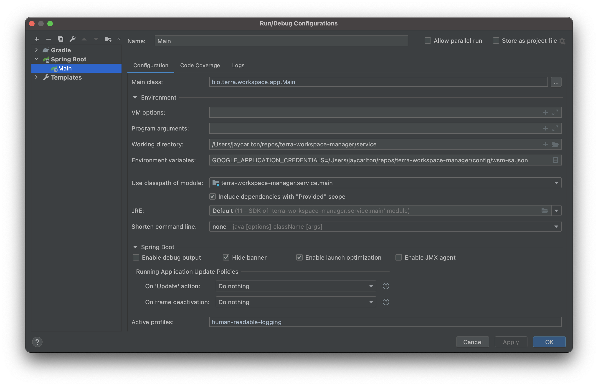

# Developing Workspace Manager in the Broad Institute Environment

This document describes the nuts and bolts of developing on WSM in the Broad
environment. Processes here rely on access to the Broad Vault server to get secrets and to
the Broad Artifactory server to read and write libraries. There are dependencies on Broad
Dev Ops github repositories and practices. Some of those are locked down, because the
Broad deployment of Terra needs to maintain a FedRamp approval level in order to host US
Government data.

You should read the [README](README.md) to understand the general structure of the service.

## OpenAPI V3 - formerly swagger
A swagger-ui page is available at /swagger-ui.html on any running instance. For existing
instances running in the Broad deployment, those are:

- dev: https://workspace.dsde-dev.broadinstitute.org/swagger-ui.html
- alpha: https://workspace.dsde-alpha.broadinstitute.org/swagger-ui.html
- staging: https://workspace.dsde-staging.broadinstitute.org/swagger-ui.html
- perf: https://workspace.dsde-perf.broadinstitute.org/swagger-ui.html
- prod: https://workspace.dsde-prod.broadinstitute.org/swagger-ui.html 

If you can't load any of the swagger pages, check that you are on **non-split** VPN before troubleshooting further.

## Layering

Workspace Manager's logic for handling requests is broken into several layers. From highest to lowest:
- Controllers (`app/controller/`): this layer performs access checks, validates input, invokes services to do the work, and packages the service output into the response. Every controller endpoint should perform an authorization check as one of the first steps, or else clearly document why it isn't doing so.
- Services (`service/`): this layer is where most work is done. Each Service class wraps an external service or a collection of related internal functions. These functions may launch [Stairway](https://github.com/DataBiosphere/stairway) Flights to perform work as a transaction. See [README](README.md#Service Code Structure) for a more detailed description of each service.
- Flights (`service/**/flight`): collections of [Stairway](https://github.com/DataBiosphere/stairway) individual logical steps which are performed in order as a transaction. Individual steps may call service or DAO methods.
- Data Access Objects (DAOs) (`db/`): wrappers around the WSM database. Methods that interact with the database directly live here, and Services call DAO methods rather than the database directly.

### REST API Class Usage
In general, API class objects are converted to and from internal WSM objects in the Controller layer.
There are two exceptions to this rule.

First, we use API objects directly to pass cloud resource object parameters through create and update methods.
There is little utility in copying the API structure into an identical internal structure, simply to make the
cloud call and discard the object.

Second, we create API response objects within flight steps. That allows the JobService to implement a generic
job response.

## GitHub Interactions

We currently have these workflows:

| Workflow         | Triggers               | Work                                                                                                        |
|------------------|------------------------|-------------------------------------------------------------------------------------------------------------|
| _test_           | on PR and merge to dev | runs the unit, connected and azure tests                                                                    |
| _pr-integration_ | on PR and merge to dev | runs the TestRunner-based integration test suite from the GHA host VM                                       |
| _nightly-tests_  | nightly at 2am         | runs the TestRunner-based integration, perf, and resiliency test suites on the wsmtest personal environment |
| _tag-publish_    | on merge to dev        | tags, version bumps, publishes client to artifactory, pushes image to GCR                                   |

## Deployment

To push versions of this repository to different environments (including per-developer
integration environments), update the
[terra-helmfile deployment definitions](https://github.com/broadinstitute/terra-helmfile). 

### On commit to main
1. New commit is merged to main
2. [The tag-publish workflow](https://github.com/DataBiosphere/terra-workspace-manager/blob/dev/.github/workflows/tag-publish.yml) is triggered. It builds the image, tags the image & commit, and pushes the image to GCR. It then sends a [dispatch](https://help.github.com/en/actions/reference/events-that-trigger-workflows#external-events-repository_dispatch) with the new version for the service to the [terra-helmfile repo](https://github.com/broadinstitute/terra-helmfile).
3. This updates the default [version mapping for the app in question](https://github.com/broadinstitute/terra-helmfile/blob/master/versions.yaml).
4. [Our deployment of ArgoCD](https://ap-argocd.dsp-devops.broadinstitute.org/applications) monitors the above repo, and any environments in which the app is set to auto-sync will immediately pick up the new version of the image. If the app is not set to auto-sync in an environment, it can be manually synced via the ArgoCD UI or API.

## Setup

### Prerequisites:

#### Postgres
We are currently using Postgres 13.1.

You do not have to run a local version of Postgres. You will see below how to run it in a
docker container. If you decide to install a local version, you have choices:
- Directly from the Postgresql website: https://www.postgresql.org/download/
- Via homebrew:
```sh
brew install postgresql@13
```
- By installing the Mac application: [Postgresql app](https://postgresapp.com/downloads.html). This
is the easiest. Just make sure to download the right version. It'll manage things for you and has a
useful menulet where the server can be turned on and off. Don't forget to create a server if you
go this route.

#### JDK
We use the Adoptium JDK version 17. (At this writing, the Mac x86 version is 17.0.2+8).
You learn about it at [Adoptium](https://adoptium.net/).

The recommended process for installing on Mac is to first install [jEnv](https://www.jenv.be/) to
manage the active version:

```sh
    brew install jenv
    # follow postinstall instructions to activate jenv...
    
    # to add previously installed versions of Java to jEnv, list them:
    # /usr/libexec/java_home -V
    # and then add them:
    # jenv add /Library/Java/JavaVirtualMachines/<JAVA VERSION HERE>/Contents/Home
```

You can install the JDK from IntelliJ::
- File menu
- Project Structure...
- Under Project Settings select Project
- Select Project SDK
- Select Download SDK...
- Select version 17
- Select Eclipse Temurin

If you use homebrew, you can do this instead:
```sh
    brew tap homebrew/cask-versions
    brew install --cask temurin17

    # If ~/.jenv/versions directory doesn't exist:
    mkdir -p ~/.jenv/versions
    jenv add /Library/Java/JavaVirtualMachines/temurin-17.jdk/Contents/Home
 ```

You may want to use jenv to set this JDK as your global setting to avoid surprises.

To switch between jdk versions, modify `.bash_profile` and run `jenv` as [described here](https://www.jenv.be/).

#### Configuring IntelliJ SDK

You will need to configure IntelliJ to use a particular SDK. Here are settings you may need to
make:
- IntelliJIdea | Preferences... | Build, Execution, Deployment | Build Tools | Gradle - set Gradle
JVM to your JDK 17
- File | Project Structure... | Project Settings | Project | Project SDK
  - set Project SDK to your JDK 17 SDK
  - set Project Language Level to 17

#### Python3
We are currently using Python 3.9.10

The build and the integration tests assume `python3` and its built-in module `venv` are available. The
build of openapi creates a python virtual environment and activates it to run the script to merge
the various YAML files comprising the REST API.

The recommended practice is to install `pyenv` and use that to install and manage your versions
of python. Follow the instructions [here](https://github.com/pyenv/pyenv#homebrew-in-macos) to
install pyenv.

Then use `pyenv` to install the right version of python like so:
```
pyenv install 3.9.10
```

In the automation, we use the `venv` to make virtual environments. The advantage of using `venv`
is that it is built in so does not require extra installation steps.
However, it is not so useful as a developer tools because it has no way to de-activate a virtual
environment. Consider installing `virtualenv` for your developer use. It can be installed using
`pip` like so:
```
python3 -m pip install virtualenv
```

### Database Configuration
Workspace Manager Service relies on a Postgresql database server containing two databases:
one for the service itself, and one for
[Stairway](https://github.com/DataBiosphere/stairway). There are two options for running
the Postgres server

#### Option A: Docker Postgres
##### Running the Postgres Container
To start a postgres container configured with the necessary databases:
```sh
./service/local-dev/run_postgres.sh start
```
To stop the container:
```sh
./service/local-dev/run_postgres.sh stop
```
Note that the contents of the database is not saved between container runs.

##### Connecting to the Postgres Container
Use `psql` to connect to databases within the started database container. For database `wsm_db` use user `dbuser` with password `dbpwd` like this:
```sh
PGPASSWORD=dbpwd psql postgresql://127.0.0.1:5432/wsm_db -U dbuser
```
For the Stairway database `wsm_stairway` use user `stairwayuser` with password `stairwaypwd`.

#### Option B: Local Postgres 
##### Database Configuration

To set up Workspace Manager's required database, run the following command, which will create the DB's and users for unit tests, Stairway, and the app itself:

```sh
psql -f service/local-dev/local-postgres-init.sql
```

### IntelliJ Setup

1. Open the repo normally (File -> Open)
2. In project structure (the folder icon with a little tetromino over it in the upper
   right corner), make sure the project SDK is set to Java 17. If not, IntelliJ should
   detect it on your system in the dropdown, otherwise click "Add JDK..." and navigate to
   the folder from the last step.
3. Set up [google-java-format](https://github.com/google/google-java-format). We use the
   spotless checker to force code to a standard format. Installing the IntelliJ plug-in
   and library makes it easier to get it in the right format from the start.
4. See some optional tips below in the ["Tips"](#tips) section.

## Running

### Writing Configuration

Running WSM and the Test Runner integration tests requires many service accounts and database
coordinates. That information is stored in Broad's Vault server. We do not want the main
code to directly depend on Vault. For example, Verily's Terra deployment will not use
Vault. So the code depends on files that hold the information.

The `scripts/write-config.sh` script is used to collect all of the needed data from vault and
store it in files in the gradle `${rootDir}` in the directory `config/`. Having a Broad Institute
account is the pre-requisite for fetching data from vault.

One advantage of having the config written in gradle `${rootDir}` is that it is visible to
github actions that run our CI/CD process.

View current usage information for `write-config.sh` by entering
```sh
./scripts/write-config.sh help
```

### Running Tests

To run unit tests:

```sh
./gradlew :service:unitTest
```
  
To run connected tests:

```sh
./scripts/write-config.sh # First time only
./gradlew :service:connectedTest
```
To run integration tests, we use Test Runner. Learn to run the Test Runner
integration tests by reading [Integration README](integration/README.md)

### Code Coverage
We use Jacoco to generate code coverage reports. Coverage information is written
to `service/build/jacoco/{task_name}.exec`, and the `combinedJaCoCoReport` 
gradle task will generate a single combined report for all test tasks run on
the same machine. This task is run automatically after test tasks and can also
be run manually.

To get coverage from integration tests, start the server under test using
`:service:jacocoBootRun` instead of `:service:bootRun`. See 
[Running Workspace Manager Locally](#Running-Workspace-Manager-Locally) for
more information.

### Running Workspace Manager Locally

To run locally, you'll first need to write configs (if you haven't already)
and then launch the application:

```sh
./scripts/write-config.sh # First time only
./gradlew :service:bootRun
```

Then navigate to the Swagger: http://localhost:8080/swagger-ui.html

You can also use the `:service:jacocoBootRun` task to run the server 
instrumented with Jacoco coverage tracking. This is useful for tracking
integration test coverage, but may incur a small performance cost.


## Publishing and Versioning

New versions of the WSM client library are automatically published with each merge to the
main branch. Since we publish very frequently, and Broad Dev Ops needs specific versions to
track through the release process, we use a variation of semantic versioning.

By default, the patch version is incremented after each merge to main. You can cause other
parts of the version to be changed as follows.
- To bump the minor version, put the string `#minor` in your commit message. The minor
version will be incremented and the patch version will be set to 0: `major.minor.0`
- To bump the major version, put the string `#major` in your commit message. The minor and
patch versions will be set to 0: `major.0.0`.

In addition, you can manually trigger the `tag-publish` github action and specify the part
of the version to change.

### Compatible Changes of Significance

We should bump the minor version number when releasing significant features that are
backward compatible.

### Incompatible Changes

Incompatible changes require incrementing the major version number. In our current state
of development, we are allowing for some incompatible API changes in the feature-locked
parts of the API without releasing a version `1.0.0`.

## Adding a new flight

Refer to https://github.com/DataBiosphere/stairway for implementing a stairway flight. 
When a new flight is added, add a new Enum entry in
service/src/main/java/bio/terra/workspace/common/logging/model/ActivityFlight.java.

If the flight has `OperationType` `DELETE`, a flight might fail while the target
is still deleted from the database. Check whether the target is deleted
in the database and log a `DELETE` activity in `WorkspaceActivityLogHook`.

## Logging During Test Runs

### Seeing Log Output
The default logging set in the `build.gradle` file does not show the log messages written
to the console. The default setup is:
```
    testLogging {
        events = ["passed", "failed", "skipped", "started"]
    }
```
You can add events to the logging so that you see the log details:
```
        events = ["passed", "failed", "skipped", "started", "standard_error", "standard_out"]
```

### Human Readable Logging
The default log format is a JSON format that presents well in Log Explorer, but is not so
easy to read. You get human readable logging by setting the `human-readable-logging`
Spring profile.

You can do this in any of the many ways to provide properties to Spring. A simple way is
by setting the environment variable as:
```sh
export spring_profiles_include=human-readable-logging
```

### Controlling Log Level
By default logging at INFO level and above are displayed. You can change the logging level
by setting yet another Spring property. For example, you can set all things terra to log
at debug level by adding this to a property YAML file (such as application.yaml):
```
logging.level.bio.terra: debug
# Use this to print SQL queries
logging.level.org.springframework.jdbc.core: trace
```
You can be more precise by putting more of the path in. You can use YAML syntax to include
multiple entries, something like (but I did not test this):
```shell script
logging:
  level:
    bio:
      terra:
        workspace:
          service:
            resource:
              controlled:
                ControlledGcsBucketResource: debug
                ControlledBigQueryDatasetResource: warn
```
And you can use an environment variable instead of editing a property file.

If you are also using human readable logging, then you can create the file 
`application-human-readable-logging.yml` and put the logging property in there.
Spring auto-magically searches for properties files for the active profiles.

## Update custom IAM role permissions for GCP projects.
For project level permissions, update `CloudSyncRoleMapping`. For resource
level permissions, update `CustomGcpIamRoleMapping`. 

When the PR with new permissions is merged and released, it will only be applied
to the workspace created **after** the WSM with the new release version. To
allow existing workspaces to contains the new permissions, a SAM admin must
run the `Admin` api `syncIamRoles` endpoint.

For each environment:
- dry run, check GCP logs to confirm new permissions/GCP projects as expected.
- wet run.

## Tips
- Check out [gdub](https://github.com/gdubw/gdub), it'll save you typing `./gradlew` over
  and over, and also takes care of knowing when you're not in the root directory, so you
  don't have to figure out the appropriate number of `../`s. 
- In IntelliJ, instead of running the local server with `bootRun`, use the `Main` Spring
  Boot configuration shared in the `.run` directory. This allows you to debug 
  service code while running integration tests or using Swagger UI. To edit it, click on
  it (in the upper right of the window), and click `Edit Configurations`. 
    
    - The environment variable GOOGLE_APPLICATION_CREDENTIALS must be set to the path to wsm-sa.json
      in the `config` directory. If this variable is missing, you may get a mysterious
      Oauth2 error when setting up a spending profile (or have other undefined behavior).
    - The Working Directory should be set to the full path to the `service` directory
    - For readable logs, put `human-readable-logging` in the `Active Profiles` field.
    - You can get live-ish reloading of for the local Swagger UI by adding the following
      override parameter:
      `spring.resources.static-locations:file:src/main/resources/api`. It's not true live
      reloading, you still have to refresh the browser, but at least you don't have to
      restart the server.

- For local development of connected tests, [comment out these lines](https://cs.github.com/DataBiosphere/terra-workspace-manager/blob/05dba30e7f597690c46c95a974d31bde532bcbbd/service/src/main/java/bio/terra/workspace/app/StartupInitializer.java?q=startupinitializer#L33-L37)
  to preserve workspace/cloud context between runs.
