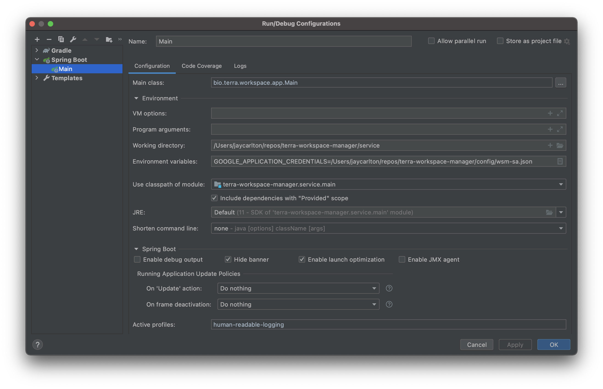

# terra-workspace-manager

This repository holds the MC Terra Workspace Manager (WSM) service, client, and
integration test projects.

* [Overview](#overview)
* [WSM Client](#wsm-client)
  * [Usage (Gradle)](#usage-gradle)
  * [Publishing and Versioning](#publishing-and-versioning)
    * [Compatible Changes of Significance](#compatible-changes-of-significance)
    * [Incompatible Changes](#incompatible-changes)
* [Deployment](#deployment)
  * [On commit to main](#on-commit-to-main)
* [Setup](#setup)
  * [Prerequisites:](#prerequisites)
    * [Postgres](#postgres)
    * [JDK](#jdk)
    * [Configuring IntelliJ SDK](#configuring-intellij-sdk)
    * [Python3](#python3)
  * [Database Configuration](#database-configuration)
    * [Option A: Docker Postgres (common)](#option-a-docker-postgres-common)
    * [Option B: Local Postgres](#option-b-local-postgres)
  * [IntelliJ Setup](#intellij-setup)
* [Running](#running)
  * [Writing Configuration](#writing-configuration)
  * [Code Coverage](#code-coverage)
  * [Running Workspace Manager Locally](#running-workspace-manager-locally)
  * [OpenAPI V3 - formerly swagger](#openapi-v3---formerly-swagger)
* [Code walk-through](#code-walk-through)
  * [Dependencies](#dependencies)
  * [Workspace Manager Service](#workspace-manager-service)
    * [Layering](#layering)
    * [REST API Class Usage](#rest-api-class-usage)
    * [Spring Boot](#spring-boot)
  * [Service Code Structure](#service-code-structure)
  * [GitHub Actions](#github-actions)
* [Tests](#tests)
  * [Running tests](#running-tests)
  * [Unit Tests](#unit-tests)
  * [Connected Tests](#connected-tests)
  * [Integration Tests](#integration-tests)
  * [Making tests fast](#making-tests-fast)
    * [Create one workspace/context/resource for entire test](#create-one-workspacecontextresource-for-entire-test)
    * [For local runs, skip workspace/context creation](#for-local-runs-skip-workspacecontext-creation)
  * [Cleaning up workspaces in tests](#cleaning-up-workspaces-in-tests)
* [Adding a new flight](#adding-a-new-flight)
* [Logging During Test Runs](#logging-during-test-runs)
  * [Seeing Log Output](#seeing-log-output)
  * [Human Readable Logging](#human-readable-logging)
  * [Controlling Log Level](#controlling-log-level)
* [Update custom IAM role permissions for GCP projects.](#update-custom-iam-role-permissions-for-gcp-projects)
* [Tips](#tips)

## Overview

WSM provides workspaces; contexts for holding the work of
individuals and teams. A _workspace_ has members that are granted some role on the
workspace (OWNER, READER, WRITER). The members can create and manage _resources_ in the
workspace. There are two types of resources:
- _controlled resources_ are cloud resources (e.g., buckets) whose attributes,
  permissions, and lifecycle are controlled by the Workspace Manager. Controlled resources
  are created and managed using Workspace Manager APIs.
- _referenced resources_ are cloud resources that are independent of the
  Workspace Manager. A workspace may hold a reference to such a resource. The Workspace
  Manager has no role in managing the resource’s lifecycle or attributes.

Resources have unique names within the workspace, allowing users of the workspace to
locate and refer to them in a consistent way, whether they are controlled or referenced.

The resources in a workspace may reside on different clouds. Users may create one _cloud
context_ for each cloud platform where they have controlled or referenced resources.

Workspace Manager provides the minimum interface to allow it to control permissions and
lifecycle of controlled resources. All other access, in particular data reading and
writing, are done using the native cloud APIs.

Controlled resources may be _shared_ or _private_. Shared resources are accessible to
workspace members with their workspace role. That is, if you have READER on the workspace,
then you can read the resource (however that is defined for the specific resource); if you
have WRITER on the workspace, then you can write the resource.

Private resources are available to a single member of the workspace. At the present time,
a private resource is available only to its creator.

WSM has latent support for _applications_. No applications exist at this time. The concept
is that an application is a distinguished service account. Owners of the workspace can
control which applications are allowed access to the workspace. If an application is given
access, then it can create application-owned resources. The goal is to allow applications
to create constellations of resources that support the application, and not let them be
messed with by workspace READERS and WRITERS.

## WSM Client
Workspace Manager publishes an API client library generated from its OpenAPI Spec v3
interface definition.

### Usage (Gradle)

Include the Broad Artifactory repositories:
```gradle
repositories {
    maven {
        url "https://broadinstitute.jfrog.io/broadinstitute/libs-snapshot-local/"
    }
}
```

Add a dependency like
```gradle
implementation(group: 'bio.terra', name: 'workspace-manager-client', version: 'x.x.x')
```
See [settings.gradle](settings.gradle) for the latest version information.

### Publishing and Versioning

New versions of the WSM client library are automatically published with each merge to the
main branch. Since we publish very frequently, and Broad Dev Ops needs specific versions to
track through the release process, we use a variation of semantic versioning.

By default, the patch version is incremented after each merge to main. You can cause other
parts of the version to be changed as follows.
- To bump the minor version, put the string `#minor` in your commit message. The minor
  version will be incremented and the patch version will be set to 0: `major.minor.0`
- To bump the major version, put the string `#major` in your commit message. The minor and
  patch versions will be set to 0: `major.0.0`.

In addition, you can manually trigger the `tag-publish` github action and specify the part
of the version to change.

#### Compatible Changes of Significance

We should bump the minor version number when releasing significant features that are
backward compatible.

#### Incompatible Changes

Incompatible changes require incrementing the major version number. In our current state
of development, we are allowing for some incompatible API changes in the feature-locked
parts of the API without releasing a version `1.0.0`.

## Deployment

To push versions of this repository to different environments (including per-developer
integration environments), update the
[terra-helmfile deployment definitions](https://github.com/broadinstitute/terra-helmfile).

### On commit to main
1. New commit is merged to main
2. [The tag-publish workflow](https://github.com/DataBiosphere/terra-workspace-manager/blob/dev/.github/workflows/tag-publish.yml) is triggered. It builds the image, tags the image & commit, and pushes the image to GCR. It then sends a [dispatch](https://help.github.com/en/actions/reference/events-that-trigger-workflows#external-events-repository_dispatch) with the new version for the service to the [terra-helmfile repo](https://github.com/broadinstitute/terra-helmfile).
3. This updates the default [version mapping for the app in question](https://github.com/broadinstitute/terra-helmfile/blob/master/versions.yaml).
4. [Our deployment of ArgoCD](https://ap-argocd.dsp-devops.broadinstitute.org/applications) monitors the above repo, and any environments in which the app is set to auto-sync will immediately pick up the new version of the image. If the app is not set to auto-sync in an environment, it can be manually synced via the ArgoCD UI or API.

## Setup

### Prerequisites:

#### Postgres
We are currently using Postgres 13.1.

By default, tests will run Postgres in a Docker container. You do not have to run a local version of Postgres.
If you decide to install a local version, you have choices:
- Directly from the Postgresql website: https://www.postgresql.org/download/
- Via homebrew:
```sh
brew install postgresql@13
```
- By installing the Mac application: [Postgresql app](https://postgresapp.com/downloads.html). This
  is the easiest. Just make sure to download the right version. It'll manage things for you and has a
  useful menulet where the server can be turned on and off. Don't forget to create a server if you
  go this route.

In order to run tests using a local Postgres instance, you'll need to set the `TEST_LOCAL_DB` environment variable
to point to a local postgres URI, e.g:
```
export TEST_LOCAL_DB='postgresql://127.0.0.1:5432'
export TEST_SINGLE_THREAD='true'
```
You **must** use `export` here for the value to be visible to Gradle. `TEST_LOCAL_DB=...` will not work!
Note that parallel tests using a shared database may interfere with each other -
[set the `TEST_SINGLE_THREAD` env var](service/gradle/testing.gradle) to restrict tests to a single thread.

#### JDK
We use the Adoptium JDK version 17. (At this writing, the Mac x86 version is 17.0.2+8).
You learn about it at [Adoptium](https://adoptium.net/).

The recommended process for installing on Mac is to first install [jEnv](https://www.jenv.be/) to
manage the active version:

```sh
    brew install jenv
    # follow postinstall instructions to activate jenv...
    
    # to add previously installed versions of Java to jEnv, list them:
    # /usr/libexec/java_home -V
    # and then add them:
    # jenv add /Library/Java/JavaVirtualMachines/<JAVA VERSION HERE>/Contents/Home
```

You can install the JDK from IntelliJ::
- File menu
- Project Structure...
- Under Project Settings select Project
- Select Project SDK
- Select Download SDK...
- Select version 17
- Select Eclipse Temurin

If you use homebrew, you can do this instead:
```sh
    brew tap homebrew/cask-versions
    brew install --cask temurin17

    # If ~/.jenv/versions directory doesn't exist:
    mkdir -p ~/.jenv/versions
    jenv add /Library/Java/JavaVirtualMachines/temurin-17.jdk/Contents/Home
 ```

You may want to use jenv to set this JDK as your global setting to avoid surprises.

To switch between jdk versions, modify `.bash_profile` and run `jenv` as [described here](https://www.jenv.be/).

#### Configuring IntelliJ SDK

You will need to configure IntelliJ to use a particular SDK. Here are settings you may need to
make:
- IntelliJIdea | Preferences... | Build, Execution, Deployment | Build Tools | Gradle - set Gradle
  JVM to your JDK 17
- File | Project Structure... | Project Settings | Project | Project SDK
  - set Project SDK to your JDK 17 SDK
  - set Project Language Level to 17

#### Python3
We are currently using Python 3.9.10

The build and the integration tests assume `python3` and its built-in module `venv` are available. The
build of openapi creates a python virtual environment and activates it to run the script to merge
the various YAML files comprising the REST API.

The recommended practice is to install `pyenv` and use that to install and manage your versions
of python. Follow the instructions [here](https://github.com/pyenv/pyenv#homebrew-in-macos) to
install pyenv.

Then use `pyenv` to install the right version of python like so:
```
pyenv install 3.9.10
```

In the automation, we use the `venv` to make virtual environments. The advantage of using `venv`
is that it is built in so does not require extra installation steps.
However, it is not so useful as a developer tools because it has no way to de-activate a virtual
environment. Consider installing `virtualenv` for your developer use. It can be installed using
`pip` like so:
```
python3 -m pip install virtualenv
```

### Database Configuration
Workspace Manager Service relies on a Postgresql database server containing two databases:
one for the service itself, and one for
[Stairway](https://github.com/DataBiosphere/stairway). For unit and connected tests, this will default
to using a Docker container. As long as you can run a container, you do not need to do any setup to run unit or connected tests.

For running WSM locally, there are two options for running
the Postgres server:

#### Option A: Docker Postgres (common)
##### Running the Postgres Container
To start a postgres container configured with the necessary databases:
```sh
./service/local-dev/run_postgres.sh start
```
To stop the container:
```sh
./service/local-dev/run_postgres.sh stop
```
Note that the contents of the database is not saved between container runs.

##### Connecting to the Postgres Container
Use `psql` to connect to databases within the started database container. For database `wsm_db` use user `dbuser` with password `dbpwd` like this:
```sh
PGPASSWORD=dbpwd psql postgresql://127.0.0.1:5432/wsm_db -U dbuser
```
For the Stairway database `wsm_stairway` use user `stairwayuser` with password `stairwaypwd`.

#### Option B: Local Postgres
##### Database Configuration

To set up Workspace Manager's required database, run the following command, which will create the DB's and users for unit tests, Stairway, and the app itself:

```sh
psql -f service/local-dev/local-postgres-init.sql
```

### IntelliJ Setup

1. Open the repo normally (File -> Open)
2. In project structure (the folder icon with a little tetromino over it in the upper
   right corner), make sure the project SDK is set to Java 17. If not, IntelliJ should
   detect it on your system in the dropdown, otherwise click "Add JDK..." and navigate to
   the folder from the last step.
3. Set up [google-java-format](https://github.com/google/google-java-format). We use the
   spotless checker to force code to a standard format. Installing the IntelliJ plug-in
   and library makes it easier to get it in the right format from the start.
4. See some optional tips below in the ["Tips"](#tips) section.

## Running

### Writing Configuration

Running WSM and the Test Runner integration tests requires many service accounts and database
coordinates. That information is stored in Broad's Vault server. We do not want the main
code to directly depend on Vault. For example, Verily's Terra deployment will not use
Vault. So the code depends on files that hold the information.

The `scripts/write-config.sh` script is used to collect all of the needed data from vault and
store it in files in the gradle `${rootDir}` in the directory `config/`. Having a Broad Institute
account is the pre-requisite for fetching data from vault.

One advantage of having the config written in gradle `${rootDir}` is that it is visible to
github actions that run our CI/CD process.

View current usage information for `write-config.sh` by entering
```sh
./scripts/write-config.sh help
```

### Code Coverage
We use Jacoco to generate code coverage reports. Coverage information is written
to `service/build/jacoco/{task_name}.exec`, and the `combinedJaCoCoReport`
gradle task will generate a single combined report for all test tasks run on
the same machine. This task is run automatically after test tasks and can also
be run manually.

To get coverage from integration tests, start the server under test using
`:service:jacocoBootRun` instead of `:service:bootRun`. See
[Running Workspace Manager Locally](#Running-Workspace-Manager-Locally) for
more information.

### Running Workspace Manager Locally

To run locally, you'll first need to write configs (if you haven't already)
and then launch the application:

```sh
./scripts/write-config.sh # First time only
./gradlew :service:bootRun
```

Then navigate to the Swagger: http://localhost:8080/swagger-ui.html

You can also use the `:service:jacocoBootRun` task to run the server
instrumented with Jacoco coverage tracking. This is useful for tracking
integration test coverage, but may incur a small performance cost.

### OpenAPI V3 - formerly swagger
A swagger-ui page is available at /swagger-ui.html on any running instance. For
local WSM:

- http://localhost:8080/swagger-ui.html

For Broad deployment, those are:

- dev: https://workspace.dsde-dev.broadinstitute.org/swagger-ui.html
- alpha: https://workspace.dsde-alpha.broadinstitute.org/swagger-ui.html
- staging: https://workspace.dsde-staging.broadinstitute.org/swagger-ui.html
- perf: https://workspace.dsde-perf.broadinstitute.org/swagger-ui.html
- prod: https://workspace.dsde-prod.broadinstitute.org/swagger-ui.html

If you can't load any of the swagger pages, check that you are on **non-split** VPN before troubleshooting further.

## Code walk-through

This section describes the nuts and bolts of developing on WSM in the Broad
environment. Processes here rely on access to the Broad Vault server to get secrets and to
the Broad Artifactory server to read and write libraries. There are dependencies on Broad
Dev Ops github repositories and practices. Some of those are locked down, because the
Broad deployment of Terra needs to maintain a FedRamp approval level in order to host US
Government data.

We use [gradle](https://gradle.org/) as our build tool. The repository is organized as a
composite build, with common build logic pulled into [convention plugins](https://docs.gradle.org/current/samples/sample_convention_plugins.html).
There are three mostly independent projects:
- _service_ - the Workspace Manager Service
- _client_ - the OpenAPI-generated client
- _integration_ - the TestRunner-based integration test project

The build structure is:
```
terra-workspace-manager
  |
  + settings.gradle
  + build.gradle
  |
  +-- buildSrc/src/main/groovy (convention plugins)
  |    |
  |    + terra-workspace-manager.java-conventions.gradle
  |    + terra-workspace-manager.library-conventions.gradle
  |
  +-- service
  |    |
  |    + build.gradle (service build; test dependency on client)
  |
  +–- client
  |    |
  |    + build.gradle
  |
  +-- integration (formerly clienttest)
       |
       + build.gradle (dependency on client)
```

This build, and others in MC Terra require access to the Broad Institute's
Artifactory server. That is where supporting libraries are published and where we publish
the WSM client

### Dependencies
We use [Gradle's dependency locking](https://docs.gradle.org/current/userguide/dependency_locking.html)
to ensure that builds use the same transitive dependencies, so they're reproducible. This means that
adding or updating a dependency requires telling Gradle to save the change.

Each WSM project has separate dependency lock state.  If you're getting errors
that mention "dependency lock state" after changing a build file, you will need to one of
these commands:

```sh
./gradlew :service:dependencies --write-locks
./gradlew :client:dependencies --write-locks
./gradlew :integration:dependencies --write-locks
```

### Workspace Manager Service
The bulk of the code is in the `service` project. This section describes that project.

#### Layering

Workspace Manager's logic for handling requests is broken into several layers. From highest to lowest:
- Controllers (`app/controller/`): this layer performs access checks, validates input, invokes services to do the work, and packages the service output into the response. Every controller endpoint should perform an authorization check as one of the first steps, or else clearly document why it isn't doing so.
- Services (`service/`): this layer is where most work is done. Each Service class wraps an external service or a collection of related internal functions. These functions may launch [Stairway](https://github.com/DataBiosphere/stairway) Flights to perform work as a transaction. See [README](README.md#Service Code Structure) for a more detailed description of each service.
- Flights (`service/**/flight`): collections of [Stairway](https://github.com/DataBiosphere/stairway) individual logical steps which are performed in order as a transaction. Individual steps may call service or DAO methods.
- Data Access Objects (DAOs) (`db/`): wrappers around the WSM database. Methods that interact with the database directly live here, and Services call DAO methods rather than the database directly.

#### REST API Class Usage
In general, API class objects are converted to and from internal WSM objects in the Controller layer.
There are two exceptions to this rule.

First, we use API objects directly to pass cloud resource object parameters through create and update methods.
There is little utility in copying the API structure into an identical internal structure, simply to make the
cloud call and discard the object.

Second, we create API response objects within flight steps. That allows the JobService to implement a generic
job response.

#### Spring Boot
The service project uses Spring Boot as the framework for REST servers. The objective is to use a minimal set
of Spring features; there are many ways to do the same thing and we would like to constrain ourselves
to a common set of techniques.

##### Configuration
We only use YAML configuration. We never use XML or .properties files.

In general, we use type-safe configuration parameters as shown here:
[Type-safe Configuration Properties](https://docs.spring.io/spring-boot/docs/current/reference/html/features.html#features.external-config.typesafe-configuration-properties).
That allows proper typing of parameters read from property files or environment variables. Parameters are
then accessed with normal accessor methods. You should never need to use an `@Value` annotation.

Be aware that environment variables will override values in our YAML configuration.
This should not be used for configuration as it makes the source of values harder to track,
but it may be useful for debugging unexpected configurations. See Spring Boot's
[Externalized Configuration documentation](https://docs.spring.io/spring-boot/docs/current/reference/html/features.html#boot-features-external-config)
for the exact priority order of configurations.

##### Initialization
When the applications starts, Spring wires up the components based on the profiles in place.
Setting different profiles allows different components to be included. This technique is used
as the way to choose the cloud platform (Google, Azure, AWS) code to include.

We use the Spring idiom of the `postSetupInitialization`, found in ApplicationConfiguration.java,
to perform initialization of the application between the point of having the entire application initialized and
the point of opening the port to start accepting REST requests.

##### Annotating Singletons
The typical pattern when using Spring is to make singleton classes for each service, controller, and DAO.
You do not have to write the class with its own singleton support. Instead, annotate the class with
the appropriate Spring annotation. Here are ones we use:

- `@Component` Regular singleton class, like a service.
- `@Repository` DAO component
- `@Controller` REST Controller
- `@Configuration` Definition of properties

##### Common Annotations
There are other annotations that are handy to know about.

Use `@Nullable` to mark method interface and return parameters that can be null.

###### Autowiring
Spring wires up the singletons and other beans when the application is launched.
That allows us to use Spring profiles to control the collection of code that is
run for different environments. Perhaps obviously, you can only autowire singletons to each other. You cannot autowire
dynamically created objects.

There are two styles for declaring autowiring.
The preferred method of autowiring, is to put the annotation on the constructor
of the class. Spring will autowire all of the inputs to the constructor.

```java
@Component
public class Foo {
    private final Bar bar;
    private Fribble fribble;

    @Autowired
    public Foo(Bar bar, Fribble fribble) {
        this.bar = bar;
        this.foo = foo;
    }
}
```

Spring will pass in the instances of Bar and Fribble into the constructor.
It is possible to autowire a specific class member, but that is rarely necessary:

```java
@Component
public class Foo {
    @Autowired
    private Bar bar;
}
```

###### REST Annotations
- `@RequestBody` Marks the controller input parameter receiving the body of the request
- `@PathVariable("x")` Marks the controller input parameter receiving the parameter `x`
- `@RequestParam("y")` Marks the controller input parameter receiving the query parameter`y`


###### JSON Annotations
We use the Jackson JSON library for serializing objects to and from JSON. Most of the time, you don't need to
use JSON annotations. It is sufficient to provide setter/getter methods for class members
and let Jackson figure things out with interospection. There are cases where it needs help
and you have to be specific.

The common JSON annotations are:

- `@JsonValue` Marks a class member as data that should be (de)serialized to(from) JSON.
  You can specify a name as a parameter to specify the JSON name for the member.
- `@JsonIgnore`  Marks a class member that should not be (de)serialized
- `@JsonCreator` Marks a constructor to be used to create an object from JSON.

For more details see [Jackson JSON Documentation](https://github.com/FasterXML/jackson-docs)


### Service Code Structure
This section explains the code structure of the template. Here is the directory structure:

```
src/main/
  java/
    bio/terra/workspace/
      app/
        configuration/
        controller/
      common/
        exception/
        utils/
      db/
        exception/
        model/
      service/
        buffer/
        crl/
        datarepo/
        iam/
        job/
        resource/
        spendprofile/
        stage/
        status/
        workspace/
  resources/
```
- `app/` For the top of the application, including Main and the StartupInitializer
- `app/configuration/` For all of the bean and property definitions
- `app/controller/` For the REST controllers. The controllers typically do very little.
  They perform access checks and validate input, invoke a service to do the work, and package the service output into the response. The
  controller package also defines the global exception handling.
- `common/` For common models, exceptions, and utilities.
  shared by more than one service.
- `common/exception/` A set of common abstract base classes that support the ErrorReport REST API
  return structure live in the [Terra Common Library ](https://github.com/DataBiosphere/terra-common-lib).
  All WSM exceptions derive from those. Exceptions common across services live here.
- `service/` Each service gets a package within. We handle cloud-platform specializations
  within each service.
- `service/buffer/` Thin interface to access the
  [Resource Buffer Service](https://github.com/DataBiosphere/terra-resource-buffer)
  for allocating GCP projects: the cloud context for Google cloud.
- `service/crl/` Thin interface to access the
  [Terra Cloud Resource Library](https://github.com/DataBiosphere/terra-cloud-resource-lib)
  used for allocating cloud resources.
- `service/datarepo` Thin interface to access the
  [Terra Data Repository](https://github.com/DataBiosphere/jade-data-repo) for making
  _referenced resources_ pointing to TDR snapshots.
- `service/iam` Methods for accessing [Sam](https://github.com/broadinstitute/sam) for
  authorization definition and checking. This service provides retries and specific methods
  for the WSM operations on Sam.
- `service/job` Methods for launching Stairway flights, waiting on completion, and getting
  flight results
- `service/resource` One of the main services in WSM. Manages controlled and referenced resources.
- `service/spendprofile` Temporary methods to use fake spend profiles. Eventually, it will
  become a thin layer accessing the Spend Profile Manager when that arrives.
- `service/stage` Feature locking service
- `service/status` Implementation of the /status endpoint
- `service/workspace` The other main service in WSM. Manages CRUD for workspaces and cloud
  contexts.
- `resources/` Properties definitions, database schema definitions, and the REST API definition

### GitHub Actions

We currently have these workflows:

| Workflow         | Triggers               | Work                                                                                                        |
|------------------|------------------------|-------------------------------------------------------------------------------------------------------------|
| _test_           | on PR and merge to dev | runs the unit, connected and azure tests                                                                    |
| _pr-integration_ | on PR and merge to dev | runs the TestRunner-based integration test suite from the GHA host VM                                       |
| _nightly-tests_  | nightly at 2am         | runs the TestRunner-based integration, perf, and resiliency test suites on the wsmtest personal environment |
| _tag-publish_    | on merge to dev        | tags, version bumps, publishes client to artifactory, pushes image to GCR                                   |

## Tests

### Running tests

```sh
# Unit tests
./gradlew :service:unitTest

# Connected tests
./gradlew :service:connectedTest

# ConnectedPlus tests
./gradlew :service:connectedPlusTest

```

For integration tests, see [Integration README](integration/README.md).

### Unit Tests
The unit tests are written using JUnit. The implementations are in
`src/test/java/bio/terra/workspace/`.
Some unit tests depend on the availability of a running Postgresql server.

Every combination of `@MockBean` creates a distinct Spring application context. Each context holds several
database connection pools: (WSM db, WSM Stairway db, and any amalgam connection pools). We have run out of
database connections due to cached application contexts.

To reduce the number of unique combinations, we have put **ALL** `@MockBean` into test base classes. That helps
limit the unique combinations. You should **NEVER** code a naked `@MockBean` in a test. They should always be
specified in these bases. That helps us control the number of unique combinations we have.

The test base classes can be found in `src/test/java/bio/terra/workspace/common/`.

The current inheritance for unit test base classes looks like this:
- `BaseTest` - the base class for unit and connected tests
  - `BaseUnitTestMocks` - the base set of mocks shared by all unit tests
    - `BaseUnitTest` - enables the right test tags and profiles for unit testing
      - `BaseUnitTestMockDataRepoService` - adds one more mock; used in one unit test
      - `BaseUnitTestMockGcpCloudContextService` - adds one more mock; used by several tests
    - `BaseAzureUnitTest` - adds mocks shared by azure unit tests and enables the right test tags and profiles

We keep the Azure tests separated from the general tests, because the Azure feature is not live in all environments.
Those tests will not successfully run in those environments.

### Connected Tests
The connected tests are also written using JUnit.
The implementations are mixed in with the unit tests in
`src/test/java/bio/terra/workspace/`. Connected tests derive from `common/BaseConnectedTest.java`.
Connected tests depend on the availability of a running Postgresql server. They also rely
on a populated "config" directory containing service accounts and keys that allows the tests
to use dependent services such as Sam, Buffer, and TDR. The config collecting process relies on
secrets maintained in Vault in the Broad Institute environment.

In general, developers writing new endpoints should add MockMVC-based unit or
connected tests to test their code (example: [WorkspaceApiControllerTest](service/src/test/java/bio/terra/workspace/app/configuration/external/controller/WorkspaceApiControllerTest.java)).
These tests let us act as if we're making HTTP calls against a local server
and validate the full request lifecycle through all
the [layers of WSM](#layering), whereas the previous style of
service-only tests did not cover code in the controller layer.

Some connected tests are tagged as `connectedPlus` tests primarily to control
the subset of tests required to be run for pull requests. Typically,
connectedTests are run as part of PR checks and connectedPlus tests run longer
and executed as part of nightly sanity tests.

### Integration Tests
Integration testing is done using
[Test Runner](https://github.com/DataBiosphere/terra-test-runner).
The integration tests live in the `integration` project. Consult the integration
[README](integration/README.md) for more details.

In the early days of the project, there were JUnit-based integration tests. We are in
process of migrating them to Test Runner.

### Pact Tests

Pact testing ensures workspace manager's APIs are compatible with the assumptions made
by its clients and that workspace manager's assumptions about its dependency APIs are
also correct.

Pact testing involves interacting with Pact Broker which requires a little setup.

To run pact tests locally:

```
# Get Pact Broker credentials
./service/src/test/render-pact-configs.sh
# Reload your environment variables, e.g. src ~/.zshrc

# Pact contract test settings
export PACT_BROKER_USERNAME=$(cat /tmp/pact-ro-username.key)
export PACT_BROKER_PASSWORD=$(cat /tmp/pact-ro-password.key)

./gradlew verifyPacts
```

If you're working on adding new pacts and making local changes to them, it might be helpful to use a local
Pact Broker instead. To set up a local Pact Broker, see:
[Contract Test Local Development](https://broadworkbench.atlassian.net/wiki/spaces/IRT/pages/2829680649/Contract+Test+Local+Development).

Once you have a local Pact Broker, you can override the `PACT_BROKER_URL` environment variable:

```
PACT_BROKER_URL=http://localhost:9292 ./gradlew verifyPacts
```

### Making tests fast

#### Create one workspace/context/resource for entire test

For connected tests, creating workspace/context is slow. Use `@BeforeAll` /
`@TestInstance(Lifecycle.PER_CLASS)` to create one workspace/context that every
test in the test file can use. [Example PR.](https://github.com/DataBiosphere/terra-workspace-manager/pull/941)

If your test changes the workspace, just undo the changes at the end of the test.
For example, if your test sets workspace properties, delete the properties at the
end of your test.

Similarly, if a resource is used by multiple tests, initialize it in `setup()`.
For example, `ControlledGcpResourceApiControllerBqDatasetTest.java` has many
tests that clone a BQ dataset. The source BQ dataset is initialized once in
`setup()`, and reused for many tests.

#### For local runs, skip workspace/context creation

This section is optional. For local development, it's useful to run tests
against existing workspaces/contexts, so you don't have to wait for workspace/context
creation. These changes should not be merged.

- [Comment out these lines](https://cs.github.com/DataBiosphere/terra-workspace-manager/blob/05dba30e7f597690c46c95a974d31bde532bcbbd/service/src/main/java/bio/terra/workspace/app/StartupInitializer.java?q=startupinitializer#L33-L37)
  When test starts postgres, DB won't be wiped.
- Comment out [`cleanup()`](https://github.com/DataBiosphere/terra-workspace-manager/blob/0764301d03814ab13e6cce5291e191201bddd205/service/src/test/java/bio/terra/workspace/app/controller/ControlledGcpResourceApiControllerBqDatasetTest.java#L132-L133) in your test,
  so workspaces aren't deleted at the end of the test.
- Run a test so that `setup()` creates workspace(s). Get workspace ID from
  DB:
  ```
  PGPASSWORD=dbpwd psql postgresql://127.0.0.1:5432/wsm_db -U dbuser
  wsm_db=> select workspace_id from cloud_context;
  
  # If you need projectId
  wsm_db=> select workspace_id, context->>'gcpProjectId' from cloud_context;
  ```
- In `setup()`, comment out workspace initialization and add:
  ```
  workspaceId = UUID.fromString("workspace-id");
  ```

Pre-requisites:

- Your test must store `workspaceId`, not `workspace`.
- Your test must be able to run more than once on the same workspace. For example,
  instead of creating a resource named `resource-name`, call it `TestUtils.appendRandomNumber("resource-name")`.

### Cleaning up workspaces in tests

We have 2 ways of cleaning up resources (WSM workspace, SAM workspace, GCP project):

1. Connected tests use Janitor. Janitor deletes GCP project and not SAM
   workspace (see
   [here](https://github.com/DataBiosphere/terra-workspace-manager/pull/755#discussion_r942717257) for details).
2. Tests call WSM `deleteWorkspace()`. This deletes WSM workspace + SAM workspace +
   GCP project.

Connected tests that use mock SamService: Tests don't need to call
`deleteWorkspace()` because there is no SAM workspace to clean up.

Connected tests that use real SamService: Tests should call `deleteWorkspace()`
to clean up SAM workspaces. Why not just call `deleteWorkspace()` and not use
janitor? Janitor is useful in case test fails (or `deleteWorkspace()` fails).

Integration tests: Tests should call `deleteWorkspace()` because integration
tests don't use janitor. Most tests don't need to worry about this because
`WorkspaceAllocateTestScriptBase.java` deletes the workspace it creates. If
your test creates a workspace, it must delete the workspace.

## Adding a new flight

Refer to https://github.com/DataBiosphere/stairway for implementing a stairway flight.
When a new flight is added, add a new Enum entry in
service/src/main/java/bio/terra/workspace/common/logging/model/ActivityFlight.java.

If the flight has `OperationType` `DELETE`, a flight might fail while the target
is still deleted from the database. Check whether the target is deleted
in the database and log a `DELETE` activity in `WorkspaceActivityLogHook`.

## Logging During Test Runs

### Seeing Log Output
The default logging set in the `build.gradle` file does not show the log messages written
to the console. The default setup is:
```
    testLogging {
        events = ["passed", "failed", "skipped", "started"]
    }
```
You can add events to the logging so that you see the log details:
```
        events = ["passed", "failed", "skipped", "started", "standard_error", "standard_out"]
```

### Human Readable Logging
The default log format is a JSON format that presents well in Log Explorer, but is not so
easy to read. You get human readable logging by setting the `human-readable-logging`
Spring profile.

You can do this in any of the many ways to provide properties to Spring. A simple way is
by setting the environment variable as:
```sh
export spring_profiles_include=human-readable-logging
```

### Controlling Log Level
By default logging at INFO level and above are displayed. You can change the logging level
by setting yet another Spring property. For example, you can set all things terra to log
at debug level by adding this to a property YAML file (such as application.yaml):
```
logging.level.bio.terra: debug
# Print SQL queries
logging.level.org.springframework.jdbc.core: trace
# Print SQL transactions
logging.level.org.springframework.transaction.interceptor
```
You can be more precise by putting more of the path in. You can use YAML syntax to include
multiple entries, something like (but I did not test this):
```shell script
logging:
  level:
    bio:
      terra:
        workspace:
          service:
            resource:
              controlled:
                ControlledGcsBucketResource: debug
                ControlledBigQueryDatasetResource: warn
```
And you can use an environment variable instead of editing a property file.

If you are also using human readable logging, then you can create the file
`application-human-readable-logging.yml` and put the logging property in there.
Spring auto-magically searches for properties files for the active profiles.

## Update custom IAM role permissions for GCP projects.
For project level permissions, update `CloudSyncRoleMapping`. For resource
level permissions, update `CustomGcpIamRoleMapping`.

When the PR with new permissions is merged and released, it will only be applied
to the workspace created **after** the WSM with the new release version. To
allow existing workspaces to contains the new permissions, a SAM admin must
run the `Admin` api `syncIamRoles` endpoint.

For each environment:
- dry run, check GCP logs to confirm new permissions/GCP projects as expected.
- wet run.

## Tips
- Check out [gdub](https://github.com/gdubw/gdub), it'll save you typing `./gradlew` over
  and over, and also takes care of knowing when you're not in the root directory, so you
  don't have to figure out the appropriate number of `../`s.
- In IntelliJ, instead of running the local server with `bootRun`, use the `Main` Spring
  Boot configuration shared in the `.run` directory. This allows you to debug
  service code while running integration tests or using Swagger UI. To edit it, click on
  it (in the upper right of the window), and click `Edit Configurations`.

  - The environment variable GOOGLE_APPLICATION_CREDENTIALS must be set to the path to wsm-sa.json
    in the `config` directory. If this variable is missing, you may get a mysterious
    Oauth2 error when setting up a spending profile (or have other undefined behavior).
  - The Working Directory should be set to the full path to the `service` directory
  - For readable logs, put `human-readable-logging` in the `Active Profiles` field.
  - You can get live-ish reloading of for the local Swagger UI by adding the following
    override parameter:
    `spring.resources.static-locations:file:src/main/resources/api`. It's not true live
    reloading, you still have to refresh the browser, but at least you don't have to
    restart the server.
    
- To run unit and connected tests with a local DB (which can be helpful for examining DB contents after testing), set the `TEST_LOCAL_DB` environment variable
  to point to a local postgres URI, e.g `export TEST_LOCAL_DB='postgresql://127.0.0.1:5432'`. See [above](/#Database Configuration) for setting up a local DB.
  - Note that parallel tests using a shared database may interfere with each other - [you can set the `TEST_SINGLE_THREAD` env var](service/gradle/testing.gradle) to restrict tests to a single thread.
